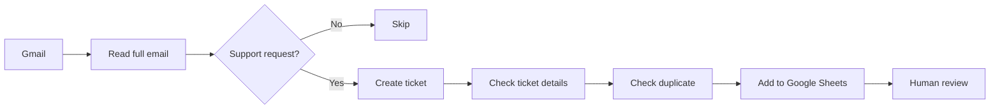

# Gmail to Google Sheets Support Ticket Logger

**Prepared for:** Client Review  
**Prepared by:** Fitri Ambarwati  

---

## 1. Project Summary

This project turns customer support emails from Gmail into organised support tickets in Google Sheets.

Instead of manually opening every email, reading the request, deciding the category, writing a summary, and copying the details into a spreadsheet, the workflow handles those repetitive steps automatically.

The final Google Sheet gives the support team a clear list of tickets to review and action.

---

## 2. What the Workflow Does

The workflow:

1. Reads recent Gmail messages.
2. Includes both read and unread emails.
3. Reads the full email, not only the subject line.
4. Identifies whether the email is a real support request.
5. Skips newsletters, promotions, spam, and unrelated emails.
6. Classifies valid support requests.
7. Creates a short issue summary.
8. Suggests the next action.
9. Drafts a suggested reply.
10. Adds the final ticket to Google Sheets.
11. Prevents the same email from being added twice.

The workflow does not automatically send replies or make account changes.

---

## 3. Main Benefit

Without automation, the support team may need to:

- open every email;
- decide whether it needs action;
- identify the issue;
- decide the priority;
- write a summary;
- draft a response;
- copy everything into Google Sheets.

This takes time and can lead to inconsistent results.

The automation reduces manual work while keeping a human in control of important decisions.

---

## 4. Simple Workflow



---

## 5. Ticket Information

Each support ticket contains 13 fields:

1. Received Date
2. Customer Name
3. Customer Email
4. Email Subject
5. Product / Service
6. Issue Category
7. Priority
8. Sentiment
9. Order / Account Reference
10. Issue Summary
11. Suggested Next Action
12. Suggested Reply
13. Status

This gives the support team enough information to understand the issue without reopening every email.

---

## 6. Example Support Cases

The workflow was tested using realistic support cases:

| Support case | Expected result |
|---|---|
| Business internet completely down | High priority and escalated |
| Slow internet and repeated dropouts | Normal priority |
| Duplicate billing charge | Billing ticket |
| Missed installation appointment | Installation ticket |
| Cancellation request | Waiting for customer verification |

The workflow also checks that suggested replies do not make unsafe promises.

For example:

- it does not promise a refund;
- it does not guarantee a technician date;
- it does not confirm cancellation before verification;
- it does not invent missing account details.

---

## 7. Tools Used

| Tool | Purpose |
|---|---|
| Gmail | Source of customer emails |
| Google Sheets | Stores the support tickets |
| Codex | Runs and manages the workflow |
| Composio MCP | Connects Codex to Gmail and Google Sheets |
| Node.js | Handles validation, duplicate checking, and workflow logic |

No Composio API key is stored inside the project files.

---

## 8. Project Files

```text
project-root/
├── README.md
├── 1-research.md
├── 2-ticket-schema.md
├── 3-deliverable.md
├── package.json
├── .env
├── .env.example
├── .gitignore
├── skills/
│   ├── gmail-support.md
│   ├── google-sheets.md
│   └── process-support-requests.md
├── sample-emails/
│   ├── 01-no-internet-business-critical.txt
│   ├── 02-slow-speed-and-dropouts.txt
│   ├── 03-duplicate-billing-charge.txt
│   ├── 04-delayed-nbn-installation.txt
│   └── 05-cancellation-request.txt
├── tools/
│   ├── gmail.js
│   ├── parser.js
│   ├── sheets.js
│   └── index.js
└── tests/
    ├── fixtures/
    ├── parser.test.js
    ├── sheets.test.js
    └── sample-flow.test.js
```

### Important files

| File | Purpose |
|---|---|
| `README.md` | General project explanation |
| `1-research.md` | Company and policy research |
| `2-ticket-schema.md` | Rules for ticket classification and safe handling |
| `3-deliverable.md` | Final client summary |
| `skills/gmail-support.md` | Gmail instructions |
| `skills/google-sheets.md` | Google Sheets instructions |
| `skills/process-support-requests.md` | Full workflow instructions |
| `tools/` | Main workflow code |
| `tests/` | Local testing files |

---

## 9. Implementation Steps

### Step 1: Define the rules

The support rules were written first.

These rules explain:

- which emails should become tickets;
- which emails should be skipped;
- how priority should be decided;
- when human review is required;
- what information must never be invented;
- what the suggested reply may and may not promise.

### Step 2: Build the project structure

The Node.js files were separated by responsibility:

- `gmail.js` reads Gmail messages;
- `parser.js` creates and validates ticket data;
- `sheets.js` prepares and writes ticket rows;
- `index.js` runs the complete workflow.

### Step 3: Test locally

Before connecting live Gmail and Google Sheets, the workflow was tested using sample emails.

This confirmed that:

- ticket fields were valid;
- the Google Sheet column order was correct;
- invalid ticket data was rejected;
- duplicate checks worked;
- suggested replies stayed within safe boundaries.

### Step 4: Connect Gmail and Google Sheets

Gmail and Google Sheets were connected through Composio MCP.

This allowed Codex to securely access both tools without building separate authentication and API connections from scratch.

The connection was tested to confirm that:

- Gmail could retrieve recent read and unread emails;
- full email bodies could be read;
- Gmail remained read-only;
- the `Tickets` tab existed;
- all 13 headers were correct;
- no existing sheet content was changed during testing.

### Step 5: Run preview through Codex

The complete workflow was first run in preview mode directly through Codex using the connected Composio MCP tools.

Codex retrieved the emails, applied the business rules, skipped irrelevant messages, validated ticket data, and checked duplicates without writing anything to Google Sheets.

This made it possible to review the proposed tickets safely before production.

### Step 6: Run production through Codex

After the preview was approved, the production workflow was run directly from Codex through Composio MCP.

Codex retrieved the Gmail messages, applied `2-ticket-schema.md`, validated the results, checked duplicates, and wrote valid tickets into the `Tickets` sheet.

The Node.js files supported local validation, row mapping, duplicate helpers, and tests. Live Gmail and Google Sheets actions were performed by Codex through MCP, not by `npm start`.

---

## 10. Preview Results

The preview test produced the following result:

| Result | Total |
|---|---:|
| Gmail messages found | 24 |
| Messages fully read | 24 |
| Valid support requests | 8 |
| Skipped messages | 16 |
| Duplicate tickets | 0 |
| Failed messages | 0 |
| Tickets written | 0 |

The 24 emails were all emails matching the 7-day Gmail search.

Only 8 were identified as valid support requests.

The other 16 were skipped because they were not relevant support requests.

No Gmail messages were changed, and no Google Sheets rows were added during preview.

### Production Result

After the preview was approved, production was run directly through Codex using Composio MCP.

The valid, non-duplicate support tickets were written to the `Tickets` sheet while Gmail remained read-only.

The sheet was then polished using the Google Sheets rules for clean white data rows, borders, dropdowns, conditional colours, and human-review fields.

---

## 11. Human Review and Safety

The workflow creates recommendations, but a human must still approve sensitive actions.

The workflow does not automatically:

- send customer replies;
- approve refunds;
- issue credits;
- promise compensation;
- cancel services;
- change account details;
- make hardship decisions;
- confirm technician dates;
- disclose private customer information.

The suggested reply is only a draft for review.

---

## 12. How to Run It

### Run local checks

Use npm only for local validation and tests:

```bash
npm run check
npm test
```

These commands check the project structure, validation rules, row mapping, duplicate logic, and sample flows.

### Test Gmail and Google Sheets

The live connection tests are run directly through Codex using Composio MCP.

Example prompt:

```text
Run the read-only Gmail and Google Sheets connection tests using the existing Composio MCP connection.

Confirm that Gmail remains unchanged, the Tickets tab exists, the exact 13 headers are valid, and no rows are written.
```

### Run preview

Preview is run directly through Codex, not through npm.

Example prompt:

```text
Run the complete Gmail-to-Google-Sheets support workflow in preview mode using the existing Composio MCP connections.

Retrieve all emails matching the configured Gmail query, include read and unread messages, read the full email body, apply 2-ticket-schema.md, validate every ticket, and check duplicates.

Do not write to Google Sheets and do not modify Gmail.

Report fetched, processed, skipped, valid, duplicate, failed, and written totals.
```

### Run production

After reviewing and approving the preview, run production directly through Codex.

Example prompt:

```text
Run the approved production workflow once through the existing Codex Composio MCP connections.

Use the current project files as the workflow instructions.

Retrieve all matching Gmail messages, keep Gmail read-only, apply 2-ticket-schema.md, validate every ticket, check duplicates, and append valid non-duplicate tickets to the Tickets sheet.

Preserve the exact 13 visible columns, do not overwrite existing rows, and apply the formatting rules from skills/google-sheets.md.

After completion, report fetched, processed, skipped, written, duplicate, and failed totals.
```

`npm start` does not run the live production workflow because the local Node.js process does not directly host the Codex Composio MCP connection.

---

## 13. Current Status

| Project area | Status |
|---|---|
| Documentation | Complete |
| Ticket rules | Complete |
| Node.js workflow | Complete |
| Local tests | Complete |
| Google Sheets connection | Complete |
| Gmail connection | Complete |
| Preview test | Complete |
| Production write | Complete through Codex MCP |

---

## 14. Future Improvements

Possible future additions:

- run automatically every day;
- process only emails received since the last run;
- update tickets when customers reply;
- create daily support summaries;
- add attachment analysis;
- create an escalation dashboard;
- connect the workflow to a CRM or help desk;
- add approval buttons before writing tickets.

---

## 15. Final Outcome

The workflow successfully turns Gmail support emails into clear, structured Google Sheets tickets.

It reduces repetitive manual work, improves consistency, prevents duplicates, and keeps sensitive decisions under human review.

The preview read 24 recent emails, identified 8 valid support requests, skipped 16 unrelated messages, and completed with no failures. After review, production was run directly through Codex and the approved tickets were written to Google Sheets while Gmail remained read-only.
